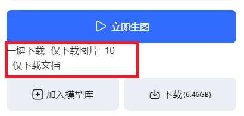
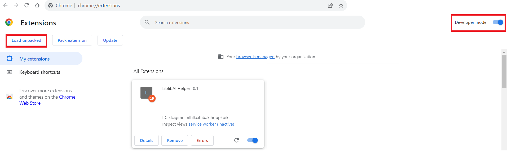

# LiblibAiHelper
A Tampermonkey script to download Liblib model and its readme, preview by one click.

首先说，我不会JS。所有代码都是NewBing写的，我只是微调。

这个项目的缘由是因为我经常使用

> Civitai网站辅助：https://greasyfork.org/zh-CN/scripts/460557-civitai%E7%BD%91%E7%AB%99%E8%BE%85%E5%8A%A9

来从C站下载模型。这个脚本会将模型，预览图和说明一并下载，非常方便。配合一系列脚本，用起来非常舒服。详见这篇文章：

> StableDiffusion模型下载管理最佳实践一条龙：https://zhuanlan.zhihu.com/p/638650568

由于Liblib一直没找到类似的工具，所以我几乎没有使用L站资源。

然而从最近的趋势来看，L站的模型更新更快，更精美，更符合我的XP。我不能一直逃避下去，因此，在NewBing的帮助下，我写了这个脚本。

油猴用法不多说，大家都懂。使用后会在“立即生图”下增加一个“一键下载”按钮（群众：你TM把这叫按钮？），点击即可。

已知的缺陷是：由于浏览器隐私政策，脚本中无法得到下载的文件名。因此我只能将标题当作模型名。

因此我想把它转成Chrome插件，因为GPT告诉我Chrome的插件可以支持该功能。结果转换之后发现Manifest V3在2023年把该功能废弃了。气。

后来我使用标题+Tab的方式决定文件名，没想到居然能对上，现在可以说没什么毛病了。

欢迎各位大佬指教和改进，我是真的对JS一窍不通。

------------------------------------------------------------------------------------------------------------------------

为方便大家使用，我将油猴脚本转换为chrome脚本，放在chrome目录下。用法如下：

在浏览器地址栏中输入：chrome://extensions/

如图所示打开开发者模式，点击“Load unpacked”，选择这个chrome目录确定即可。

理论上这个插件也能用在Edge上。

------------------------------------------------------------------------------------------------------------------------

20201214更新：修复了下载图片的BUG，增加了选项和功能，可以仅下载图片或文档，并且能指定下载图片的数量。

